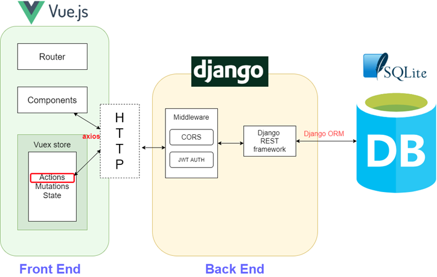
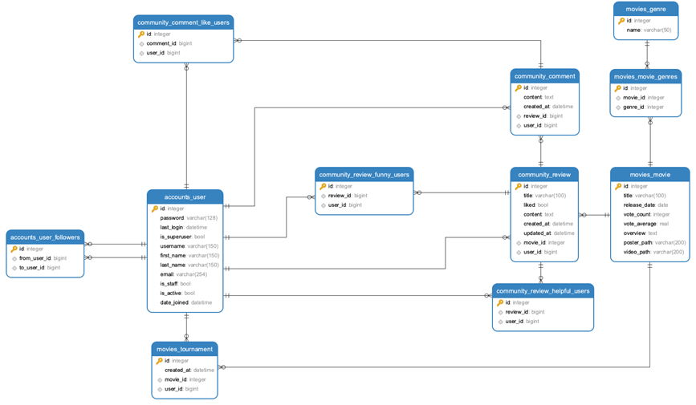

<h1 align="center">Welcome to MOYA👋</h1>


> 영화 정보 기반 추천 서비스 (싸피 5기 최종 프로젝트)

### 🏠 [배포사이트](https://swhan9404.github.io/MoyaMoya/#/)   🎬[Demo 시연영상](https://www.youtube.com/watch?v=9uv36iMI6j8&ab_channel=%EA%B9%80%EC%9C%A4%EB%B9%88)  🎤 [Presentation](https://drive.google.com/file/d/1wGFPR4kyl5CxjFnAw65OG3uJsZz08rtn/view)

<br>

## **✨ Description**

```bash
지나가면서 슬쩍 영화를 보고, 
"이 영화 모야? 괜찮은데?"
라는 생각이 들게 만들고 싶다는 소망으로 제작한 영화 정보 커뮤니티 홈페이지 입니다.
```


## 🤼함께 고생한 팀원

-1622119699403.png)


## 🔍 서비스 기능

|      | 기능                                     | 기능설명                                                     |
| ---- | ---------------------------------------- | ------------------------------------------------------------ |
| 1    | 반응형 로그인 /회원가입                  | JWT 토큰을 통한 유저 회원가입 및 인증 기능 구현              |
| 2    | 로그아웃                                 | localstorge에 저장한 JWT 토큰 삭제 기능 구현                 |
| 3    | 유저 팔로우                              | 유저간의 팔로우 및 팔로잉 기능 구현                          |
| 4    | 마이페이지 조회                          | 유저 정보, 16강 우승 영화, 좋아요한 영화 목록조회 기능 구현  |
| 5    | tmdb 자료 추출 및 DB화                   | tmdb API의 1400여개의 영화와 19개의 장르 DB화                |
| 6    | 비슷한 장르의 추천 영화 조회             | 해당 영화와 같은 장르를 가지고 있는 영화 중 평점이 높은 순서대로 추천 기능 구현 |
| 7    | 단일 영화 페이지 조회                    | 세부 영화 정보 표현, 트레일러 영상 및 비슷한 영화 추천 기능 구현 |
| 8    | 영화 메인페이지 조회                     | 평점이 높은순, 개봉 예정, 많은 사람이 본 영화순으로 20개씩 슬라이더 와 carousel 로 표현 기능 |
| 9    | 16강 영화월드컵                          | 16개 랜덤 영화추출 및 영화 월드컵 기능 구현                  |
| 10   | 리뷰 생성/ 삭제                          | 특정 영화의 리뷰 생성 기능 및 삭제 구현                      |
| 11   | 댓글 생성/ 삭제                          | 특정 리뷰의 댓글 생성 기능 및 삭제 구현                      |
| 12   | 리뷰 좋아요/재밌어요/도움되요 기능       | 특정 리뷰가 좋아요/재밌어요/도움되요 의 추가 및 삭제 기능 구현 |
| 13   | 댓글 좋아요 기능                         | 특정 댓글의 좋아요 추가 및 삭제 기능                         |
| 14   | 리뷰 전체 페이지 조회                    | 사용자들이 작성한 모든 리뷰들을 카드 형식으로 조회 및 사용자 화면 크기에 따른 갯수 출력 조절 기능 구현 |
| 15   | 단일 리뷰 페이지 조회                    | 리뷰 내용과 댓글 및 좋아요 기능 구현                         |
| 16   | 인피니티 스크롤 기능                     | 리뷰 전체 페이지에서 스크롤을 최하단에 도착할 시 8개씩 리뷰글 추가 조회, throttle로 UX 최적화 |
| 17   | 반응형 아이콘 만들기(하트)               | Anime JS를 활용한 애니메이션과 css tranistion을 통한 폭죽 애니메이션 기능 구현 |
| 18   | gravatar 기능                            | user의 email 기반으로 만드는 아바타 이미지 기능 구현         |
| 19   | UI/UX 생성 시간 조회                     | 사용자를 기준으로 한 상대시간을 표현하여 직관적인 시간 표현 기능 구현 |
| 20   | 비로그인시 next redirect 기능            | JWT 토큰을 기반으로 필수 로그인 페이지 접근시 login 페이지로 보내고 로그인 성공시 원래 가려고 했던 페이지로 push 기능  구현 |
| 21   | 404 페이지 기능                          | 없는 URL로 요청시 404 page로 push 구현                       |
| 22   | 없는 영화, 리뷰 및 유저 페이지 접근 제한 | 동적 라우팅을 사용한 단일 영화, 단일 리뷰, 유저 페이지의 경우 없는 페이지로 접근시 경고창 표시후 main 페이지 이동 기능  구현 |
| 23   | admin페이지                              | Django Admin 을 사용하여 유저, 영화, 리뷰에 대한 정보 제어할 수 있도록 기능 구현 |


## 🔧 Tech Stack




## ✏️ ERD



## 🔍 Overview

> gif 용량이 매우매우 큰 관계로 데모영상을 추천드립니다. 

### 시작화면


### 로그인 및 회원가입


### 영화 메인 및 세부 페이지 


### 리뷰 작성 하기 


### 리뷰 메인 및 세부 페이지


### 영화 월드컵


### 마이페이지


### 404 page


## 🏃 Steps to run
``` bash
Backend
$ cd final_back
$ python -m venv venv
$ source venv/Scripts/activate
$ python install -r requirements.txt
$ python manage.py loaddata DBdump/0526_movie.json
$ python manage.py loaddata DBdump/0526_accounts.json
$ python manage.py loaddata DBdump/0526_community.json
$ python manage.py runserver
```

``` bash
Frontend
$ cd final_front
$ npm install
$ npm run serve
```


## ✍🏻프로젝트간 이슈 정리

### [프로젝트기록장](projectrecord.md)

